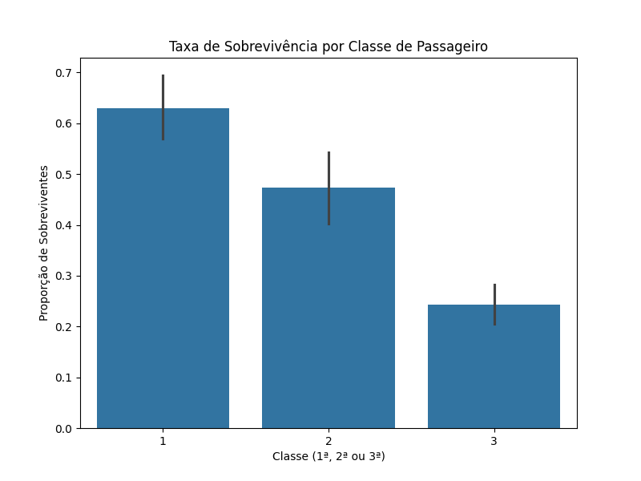

# Análise Exploratória de Dados - Desastre do Titanic (SCTEC)

## 1. Introdução
Este repositório contém o projeto de Análise Exploratória de Dados (AED) desenvolvido para a atividade prática extra da trilha 'Carreira Tech' do programa SCTEC Introdução ao Data Science (IP 20h A).pdf]. O objetivo é identificar padrões de sobrevivência entre os passageiros do Titanic utilizando Python.

## 2. Configuração do Ambiente e Execução
Para garantir a integridade do projeto, foi utilizado um ambiente virtual isolado (**venv**) no Windows 8.1. 

### Passo a passo para reprodução:
1. Clone o repositório.
2. Ative o venv: `.\venv\Scripts\activate`.
3. Instale as dependências: `pip install -r requirements.txt`.
4. Execute o script principal: `python desafio_extra.py`.

## 3. Tratamento de Dados
Durante a fase de preparação, utilizou-se o método `df.info()` para mapear a estrutura do dataset. Foi realizado o tratamento de valores nulos na coluna 'Age' (Idade) através da imputação pela média, evitando perdas significativas na amostra e mantendo o rigor estatístico exigido Introdução ao Data Science (IP 20h A).pdf].

## 4. Insights e Visualização
A análise focou na relação entre a classe socioeconômica (`Pclass`) e a taxa de sobrevivência. O gráfico gerado demonstra que a 1ª classe teve uma taxa de sobrevivência superior a 60%, enquanto na 3ª classe esse valor ficou abaixo de 30%.

**Análise Técnica da Visualização:**
O gráfico inclui barras de erro que representam o intervalo de confiança de 95%. A não sobreposição dessas barras entre a 1ª e a 3ª classe confirma que a disparidade social observada é estatisticamente significante, reforçando a conclusão de que a posição social foi um fator crítico no desastre.